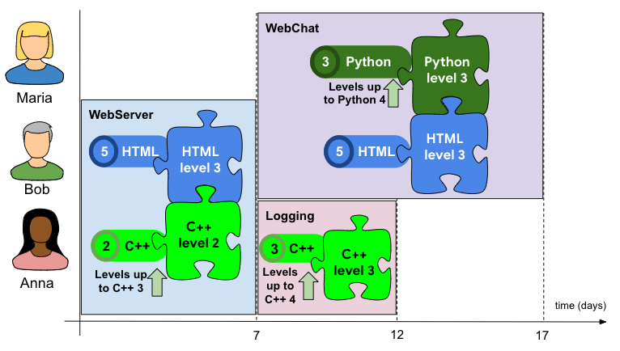

# Hashcode Challenge 2022
This repo contains our team's basic setup for our solution to the qualification round for the hash code 2022 challenge.

More information: [Google Hash Code](https://codingcompetitions.withgoogle.com/hashcode)

## Problem
### Summary
> You are given a list of contributors, who have already mastered various skills, and a list of projects with different skill requirements. Contributors can improve their skills by completing projects and can mentor each other to work is roles in which they couldn't succeed on their own. Your task is to assign contributors to project roles that fit their qualifications and maximize the score for completed projects.
### Contributors
* A contributor has 
** A name 
** >= 1 skill with a level (0, 1, 2, ..)
* Not possessing a skill => level 0

### Projects
* A project has
** A name
** A duration in days (how long to complete once started)
** Score for completion
** Best before time in days
*** If the project is worked on during or after the best before day, it loses 1 point for each day it is late, but no less than 0 points.
** A list of >=1 roles (skills at certain level) for the required contributors
* A contributor can fill at most one role on a single project

### Filling roles and mentorship
* A contributor can be assigned to a project for a role if
** They have the skill at the required level or higher OR
** They have the skill one level below the required level, if another contributor on the project (assigned to a _different_ role) has the skill at least at the required level
* A contributor can mentor multiple people at once, also for the same skill
* A contributor can mentor and be mentored at the same time

#### Learning
* When a project is completed
** Contributors working in a project where the required skill level was equal or higher: Their level is improved by 1
** Other contributors keep the skill level (even if they mentored)
* Note: Even if the project scores 0, contributors will get a level up

### Assignments
* Each contributor can start working day 0
* A contributor can only be assigned to one project at a time
* When a project is up, the contributor becomes available again

## Input and output structure
### Input
Example:
```
3 3                 // 3 contributors, 3 projects
Anna 1              // Contributor Anna with 1 skill
C++ 2               // Has C++ skill at level 2
Bob 2               // Contributor Bob with 2 skills
HTML 5              // Has HTML skill at level 5
CSS 5               // Has CSS skill at level 5
Maria 1             // Contributor Maria with 1 skill
Python 3            // Has Python skill at level 3
Logging 5 10 5 1    // Project Logging: Takes 5 days to complete, has a score of 10, is done best before day 5 and needs 1 contributor
C++ 3               // That needs to have C++ at level >= 3 (2 with mentoring)
WebServer 7 10 7 2  // Project WebServer: Takes 7 days to complete, has a score of 10, is done best before day 7 and needs 2 contributors
HTML 3              // 1st contributor: Needs HTML at level >= 3 (2 with mentoring)
C++ 2               // 2nd contributor: Needs C++ at level >= 2 (1 with mentoring)
WebChat 10 20 20 2  // Project WebChat: Takes 10 days to complete, has a score of 20, should be done best before day 20 and needs 2 contributors
Python 3            // 1st contributor: Needs Python at level >= 3 (2 with mentoring)
HTML 3              // 2nd contributor: Needs HTML at level >= 3 (2 with mentoring)
```

### Output
```
3           // Three projects are planned
WebServer   // Assignments for project WebServer
Bob Anna    // Bob -> 1st role, Anna -> 2nd role
Logging     // Assignments for project Logging
Anna        // Anna -> 1st role
WebChat     // Assignments for project WebChat
Maria Bob   // Maria -> 1st role, Bob -> 2nd role
```

Note: The projects are executed in the order they are written if a contributor is assigned to multiple projects.
